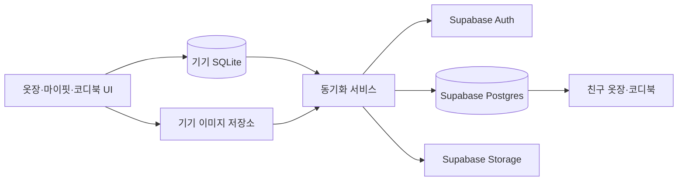

<div align="center">
  
  <h1>룩부기 (LookBoogie)</h1>
  <p>거북이 마스코트와 함께 옷을 기록하고 코디를 만드는 오프라인 퍼스트 옷장 앱</p>
</div>

룩부기는 옷 사진과 메타데이터를 기기에 먼저 저장해 네트워크 없이도 개인 옷장, 마이핏, 코디북을 사용할 수 있게 만든 React Native 앱입니다. 로그인한 사용자는 Supabase에 데이터를 동기화하고 친구 요청을 주고받아 서로의 옷장과 코디북을 볼 수 있습니다.

- 현재 앱 버전: `1.2.0`
- Android 패키지: `com.lookboogie.app`
- URL scheme: `lookboogie://`

## 주요 기능

### 옷장

- 카메라 또는 갤러리에서 옷 사진 등록
- 드래그·핀치 확대가 가능한 비율 크롭과 `0~360°` 회전
- 브러시 크기 조절, 실행 취소·다시 실행·초기화를 지원하는 수동 배경 지우개
- 사진 기반 대표색 추천과 사용자 색상 팔레트
- 이름, 브랜드, 카테고리, 계절, 색상, 태그, 핏/사이즈 메타데이터
- 이름·브랜드·계절·색상·태그 통합 검색과 정렬·필터
- 3열 그리드, 옷 상세 수정, 소속 코디 바로가기
- 사용자 카테고리, 색상, 핏/사이즈 옵션 추가·수정·순서 변경

### 마이핏

- 직접 옷을 입은 사진을 한 장씩 기록
- 하나의 마이핏에 여러 옷과 0~1개의 코디북 연결
- 연결된 옷·코디 확인, 교체, 해제 및 마이핏 수정·삭제
- 옷·코디 상세에서 연결된 마이핏으로 이동하고 원래 상세 화면으로 복귀
- 로컬 SQLite 저장, JSON 백업 및 Supabase 이미지·메타데이터 동기화

### 코디북

- 옷장 검색과 카테고리 필터를 통한 옷 선택
- 캔버스에서 옷 이동·크기 조절·회전·삭제 및 레이어 배치
- 코디 이름, 계절, 태그 저장과 검색
- 저장된 배치 그대로 목록 미리보기 제공
- 코디에 사용된 옷 목록과 옷 상세 화면 연결
- 원본 옷이 삭제돼도 코디의 이미지·이름·브랜드 스냅샷 유지

### 계정·친구·동기화

- 이메일, Google, Kakao 로그인
- 중복 불가 룩부기 ID와 친구에게 보이는 닉네임 설정
- ID로 친구 요청, 수락·거절, 친구 목록 검색
- 내 화면과 같은 검색·카테고리 구성을 갖춘 친구 옷장·코디북
- 옷, 코디, 마이핏별 클라우드 동기화 상태 표시
- 로컬 JSON 백업 내보내기·가져오기와 원격 이미지 복원
- 클라우드 계정 및 연결 데이터 탈퇴

## 기술 스택

| 영역 | 기술 |
| --- | --- |
| 앱 | React Native 0.86, React 19, Expo SDK 57, TypeScript |
| 로컬 데이터 | Expo SQLite, Expo FileSystem, AsyncStorage |
| 이미지 | Expo Image Picker, Expo Image Manipulator, React Native SVG |
| 백엔드 | Supabase Auth, Postgres, Storage, Edge Functions |
| 인증 | Google Credential Manager / Google Sign-In, Kakao Native SDK |
| UI | Lucide React Native, React Native Safe Area Context |
| 빌드 | Expo Prebuild, Gradle, EAS Build |

## 데이터 흐름



개인 데이터의 기준은 기기 로컬 저장소입니다. 저장과 조회는 로컬에서 먼저 처리하고, 로그인 및 네트워크 연결이 가능할 때 Supabase에 동기화합니다. 친구 데이터 조회와 클라우드 계정 기능에는 네트워크가 필요합니다.

동기화 아이콘은 다음 상태를 나타냅니다.

- `CloudCheck`: Supabase 레코드가 확인된 동기화 완료 상태
- `CloudAlert`: 로컬 전용, 업로드 대기 또는 동기화 실패 상태

## 시작하기

### 준비 사항

- Node.js `22.13.0` 이상 권장
- npm
- Android Studio와 Android SDK
- Android 네이티브 빌드용 JDK 21
- iOS 빌드 시 macOS와 Xcode
- 클라우드 기능 사용 시 Supabase 프로젝트

Expo Go에는 Google·Kakao 네이티브 모듈이 포함되지 않으므로 실제 인증 테스트는 개발 빌드 또는 APK에서 진행해야 합니다.

### 설치

```bash
git clone https://github.com/0xseo/LookBookie.git
cd LookBookie
npm ci
cp .env.example .env
```

`.env`에 사용할 서비스의 공개 클라이언트 값을 입력합니다.

```dotenv
EXPO_PUBLIC_SUPABASE_URL=
EXPO_PUBLIC_SUPABASE_PUBLISHABLE_KEY=
EXPO_PUBLIC_SUPABASE_STORAGE_BUCKET=clothes
EXPO_PUBLIC_GOOGLE_WEB_CLIENT_ID=
EXPO_PUBLIC_GOOGLE_IOS_CLIENT_ID=
EXPO_PUBLIC_KAKAO_NATIVE_APP_KEY=
```

`EXPO_PUBLIC_*` 값은 앱 번들에서 확인할 수 있습니다. Supabase `service_role` 키, Google/Kakao Client Secret, keystore 비밀번호 같은 비밀값은 여기에 넣지 않습니다.

### 실행

```bash
# Metro 개발 서버
npm start

# Android 개발 앱 생성 및 실행
# 룩부기 배포 앱과 데이터가 분리된 com.lookboogie.app.debug를 사용합니다.
npm run android

# iOS 네이티브 개발 앱
npm run ios

# TypeScript 검사
npm run typecheck
```

`npm run android:prebuild`는 Android 개발 패키지만 미리 생성할 때 사용합니다. 웹 스크립트도 제공하지만 네이티브 로그인과 일부 이미지 기능은 모바일 빌드를 기준으로 개발되어 있습니다.

## Supabase 설정

데이터베이스, RLS 정책, Storage 버킷, 친구 관계와 태그 스키마는 [`supabase/migrations`](./supabase/migrations)에 있습니다. 원격 프로젝트에 처음 연결할 때 다음 순서로 적용합니다.

```bash
npx supabase login
npx supabase link --project-ref <PROJECT_REF>
npx supabase db push --dry-run
npx supabase db push
npx supabase functions deploy delete-account
```

마이그레이션은 `public.clothes`, `public.fits`, `public.outfits`, `public.profiles`, `public.friendships`와 `clothes` Storage 버킷을 구성합니다. 모든 사용자 데이터 테이블의 RLS를 유지하고, 새 Supabase 프로젝트에서 Data API 자동 노출이 꺼져 있다면 `authenticated` 역할에 필요한 테이블 권한이 부여됐는지도 확인합니다.

Google·Kakao 콘솔의 패키지, 인증서 지문, nonce 및 Supabase provider 설정은 [`docs/social-auth-setup.md`](./docs/social-auth-setup.md)를 참고하세요. Apple 로그인 구현은 보관되어 있지만 현재 앱 UI에서는 비활성화되어 있습니다.

## 빌드

### EAS Android 빌드

```bash
# 내부 배포용 APK
npx eas build --platform android --profile preview

# 스토어 배포용 AAB
npx eas build --platform android --profile production
```

### 로컬 Android release APK

릴리스 빌드 전 `app.json`의 `expo.version`과 `expo.android.versionCode`를 올린 뒤 production 패키지로 native project를 생성합니다.

```bash
npx expo prebuild --platform android

export LOOKBOOGIE_RELEASE_STORE_FILE=/absolute/path/to/release.jks
export LOOKBOOGIE_RELEASE_STORE_PASSWORD=<STORE_PASSWORD>
export LOOKBOOGIE_RELEASE_KEY_ALIAS=<KEY_ALIAS>
export LOOKBOOGIE_RELEASE_KEY_PASSWORD=<KEY_PASSWORD>

./android/gradlew -p android app:assembleRelease
```

완성된 APK는 `android/app/build/outputs/apk/release/app-release.apk`에 생성됩니다. keystore, `credentials.json`, `.env`는 Git에 커밋하지 않습니다.

## 프로젝트 구조

```text
LookBookie/
├── App.tsx                    # 앱 상태, 화면 전환, 로컬·클라우드 흐름 조정
├── constants/                # 디자인 토큰
├── src/
│   ├── components/           # 공통 UI, 다이얼로그, 입력·관리 컴포넌트
│   ├── hooks/                # 카테고리·색상·핏/사이즈·키보드 상태 훅
│   ├── screens/              # 옷장, 마이핏, 코디북, 친구, 마이페이지, 이미지 편집 화면
│   ├── services/             # 인증, Supabase 동기화, 친구, 백업 로직
│   ├── storage/              # SQLite와 로컬 이미지 저장
│   └── types/                # 옷, 마이핏, 코디, 친구, 동기화 타입
├── supabase/
│   ├── migrations/           # 원격 Postgres 스키마와 RLS 정책
│   └── functions/            # 계정 탈퇴 Edge Function
├── docs/                     # 운영 및 인증 설정 문서
├── AGENTS.md                 # 개발 순서와 에이전트 작업 규칙
├── DESIGN.md                 # 룩부기 디자인 시스템
└── CHANGELOG.md              # 작업 이력
```

## 개발 규칙

작업 전 [`AGENTS.md`](./AGENTS.md)와 [`DESIGN.md`](./DESIGN.md)를 먼저 확인합니다.

- 개인 옷장 기능은 네트워크가 끊겨도 사용할 수 있어야 합니다.
- UI와 데이터·동기화 로직의 책임을 분리합니다.
- 새 라이브러리나 구조 변경 전에 기존 구현과 오류 원인을 먼저 확인합니다.
- 코드 또는 주요 동작을 변경하면 `CHANGELOG.md`와 `execution_log.csv` 최상단에 기록합니다.
- 자동 배경 제거는 아직 제공하지 않으며, 현재는 온디바이스 수동 지우개를 사용합니다.
